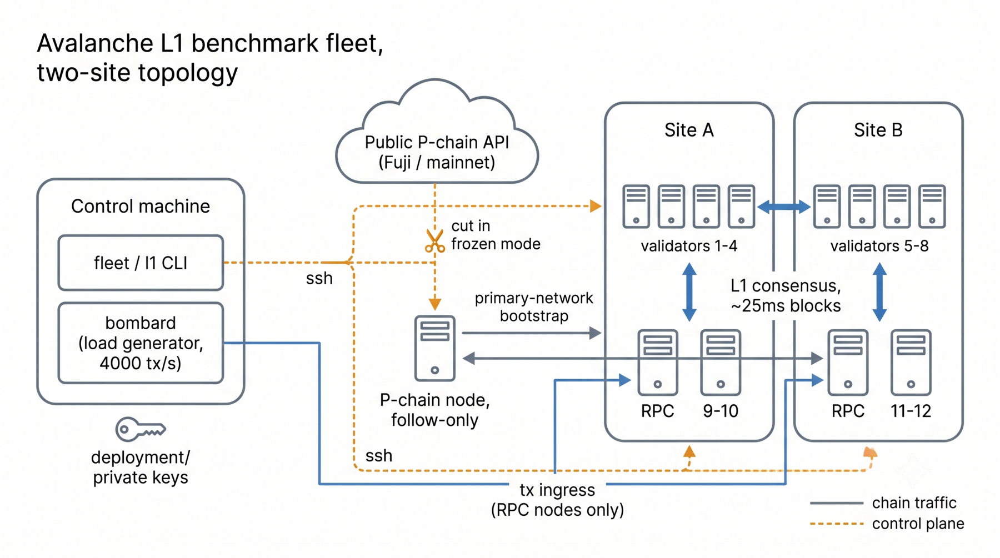
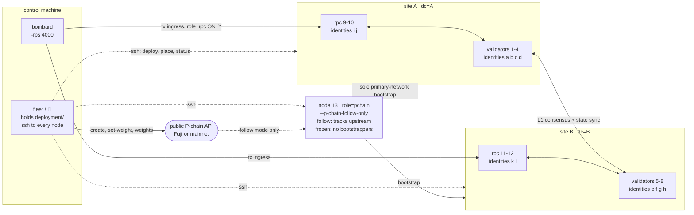

# Avalanche for Isolated Networks

Benchmark and failover toolset for Avalanche L1s in isolated networks: no internet egress, fixed validator membership, PoA. Stand up an L1 on Fuji or mainnet, run it airgapped, drive load, and drill data-center failover by moving staking identities (key swap) or stake weight, on one deployment, with no chain re-creation between the two.

Operator manual. Rationale and decision history: **[DESIGN.md](DESIGN.md)**.

## What it needs

Linux hosts reachable from one control machine over ssh, and a P-chain API endpoint (public or your own) for chain creation and weight changes. Nothing else. There is no provisioning layer here: you bring the machines, `nodes.ini` describes them, and the toolset deploys onto them.

The fleet we develop and test against is EC2 across two AWS regions, which is why some notes below cite AWS behaviour. That is our test bed, not a requirement, and none of the tooling knows about a cloud provider. Bare metal, two physical data centers, or twelve VMs on one hypervisor all work; the only thing `dc=` tags do is group nodes for display and selectors.

## Runbooks

### Fresh chain on a fresh fleet

```bash
cp nodes.ini.example nodes.ini    # edit host= lines, exactly one role=pchain
cp .env.example .env              # NETWORK, PCHAIN_API, FUNDING_PRIVATE_KEY, SSH_*
go run ./cmd/l1 address           # fund the printed P-chain address
go run ./cmd/l1 create            # generates deployment/ if absent, then both L1s
make pack                         # remote-benchmark.tar.gz: binaries + configs, no sources
# ship the archive to control, extract, then from the control host:
./bin/fleet deploy follow         # P-chain tracks the public network
./bin/fleet status                # expect 12x up, MODE synced, L1 STATE complete
./bin/bombard -rps 4000 -duration 5m
```

### Frozen (airgapped) start

`deploy frozen` needs an archive that already contains the conversions, so the P-chain must sync and be captured first.

```bash
./bin/fleet pchain follow         # first-run initializer, P-chain node only
./bin/fleet status                # wait for MODE=synced and L1 STATE=complete
./bin/fleet pchain archive        # writes ./pchain.tar.gz, refuses to overwrite
./bin/fleet deploy frozen         # freezes the P-chain, then starts the L1 fleet
```

Do not substitute `deploy follow` here: it starts the whole L1 fleet before the archive exists.

### Catching the P-chain up after a new create

A frozen P-chain has no upstream, so anything issued after the freeze (a new `create`, a `set-weight`, a `topup`) is invisible to the fleet. Unfreeze, let it replay, then re-freeze.

```bash
./bin/fleet pchain follow         # unfreeze: restores embedded bootstrappers, restarts, replays
./bin/fleet status                # wait for MODE=synced and L1 STATE=complete
rm pchain.tar.gz                  # archive refuses to overwrite
./bin/fleet pchain archive
./bin/fleet pchain freeze
./bin/fleet deploy frozen         # re-deploys the L1 fleet against the new chain
```

Replay from a recent freeze is seconds. A cold sync from an empty database is minutes (Fuji measured about 6). `deploy frozen` will **not** re-seed from the archive while the remote `db/` is nonempty: an existing database is authoritative. Follow-then-freeze is the only way to move a frozen snapshot forward.

Issue weight changes while the P-chain node is following. A transaction submitted while frozen confirms publicly but does not reach the fleet until it follows again.

### Re-creating the chain

```bash
./bin/l1 destroy                  # reclaims every validator balance, removes deployment/
./bin/l1 create                   # regenerates identities, creates both L1s
# then the catch-up runbook above, since the new conversions are past the frozen height
```

### Drills

```bash
./bin/fleet stop 5 6 7 8          # graceful node loss
./bin/fleet stop dc=B             # graceful DC loss
./bin/fleet destroy dc=B          # abrupt loss: SIGKILL plus L1 chain data wipe
./bin/fleet start dc=B            # bring back, re-pushing assigned identities
./bin/fleet place a 5             # key-swap failover: converge, move, restart the mismatched
./bin/l1 set-weight d 100000      # weight-change failover
```

## Files

| Path | Written by | Contents |
|---|---|---|
| `nodes.ini` | operator | machines, roles, optional DC tags. No secrets. |
| `.env` | operator | network, P-chain API, funding key, ssh access |
| `deployment/identities/<letter>` | `keygen` | per-identity TLS and BLS keys |
| `deployment/manager/<letter>` | `keygen` | committee BLS signing keys, control-side only |
| `deployment/genesis-funds.key` | `keygen` | EVM key holding the genesis allocation, used by `bombard` |
| `deployment/public.json` | `keygen` | public handover: NodeIDs, PoPs, initial weights, genesis address |
| `deployment/placement.json` | `keygen`, `place` | machine to identity bijection, control-side truth |
| `deployment/genesis.json` | `create` | rendered genesis, stamped with creation time |
| `deployment/network.env` | `create` | subnet, chain, and conversion transaction IDs |
| `deployment/genesis-oracle.json` | `create` | rendered oracle genesis (only with oracle roles) |
| `deployment/oracle-feeder.key` | `keygen` | EVM key funded on both chains, drives `oracle feed`/`relay` |
| `pchain.tar.gz` | `pchain archive` | certified P-chain `db/` snapshot |

`deployment/` holds private keys. It is never in the pack artifact and never committed.

## nodes.ini

```ini
# <node-number> host=<address> role=validator|rpc|pchain|archive|oracle-validator|oracle-rpc [dc=<tag>]
1  host=10.0.0.11 role=validator dc=A
5  host=10.1.0.11 role=validator dc=B
9  host=10.0.0.15 role=rpc       dc=A
13 host=10.2.0.10 role=pchain
14 host=10.0.0.17 role=archive   dc=A
15 host=10.0.0.18 role=oracle-validator dc=A
19 host=10.0.0.15 role=oracle-rpc       dc=A
```

| Rule | Detail |
|---|---|
| Machines are numbers | data roots, unit names, and inventory keys all use `<n>` |
| Identities are letters | `a`, `b`, `c`, assigned to nodes in ascending number order at keygen |
| Valid shapes | 1 validator + 0 RPC (dev), or >= 4 validators + >= 1 RPC (failover). 2 or 3 validators are refused. |
| Exactly one `pchain` | unregistered, stable TLS identity, no BLS signer, never key-swapped |
| Initial weights | first three validators by node number get 100000, the rest 1000 |
| `dc=` | display and maintenance-selector only. Nothing functional depends on it. |
| Co-location | several nodes may share a host. Ports are positional by node order on that host: 9650/9651, 9652/9653, 9654/9655. |
| Weights are not inventory | on-chain weight is the only truth |
| `archive` | 0 or >= 2: an RPC-shaped main-L1 node with pruning and state-sync disabled (`chain-config-archive.json`). Must exist from genesis (an archive cannot state-sync); never a bootstrap anchor. |
| Oracle roles come together | `oracle-validator` / `oracle-rpc` declare the optional oracle L1 (`subnet-config-oracle.json`, all weights 1000, no key swaps). Omit both for no oracle chain; each requires the other. |

## .env

```dotenv
NETWORK=fuji                              # fuji | mainnet, never "testnet"
PCHAIN_API=https://api.avax-test.network  # no query string, see PCHAIN_API_TOKEN
PCHAIN_API_TOKEN=                         # optional rate-limit bypass, secret, never commit
FUNDING_PRIVATE_KEY=                      # 64 hex chars, no 0x, pays P-chain fees
SSH_USER=ubuntu
SSH_KEY_PATH=/home/ubuntu/.ssh/fleet
```

Unknown fields, missing fields, and malformed values fail the command before it does any work. No aliases, no auto-discovery, no silent repair.

`PCHAIN_API_TOKEN` is sent as the `token` query argument to the `PCHAIN_API` host and to no other host. It cannot be appended to `PCHAIN_API`: the AvalancheGo client overwrites the query string, so a token placed there is silently dropped.

`go run ./cmd/l1 keygen-funding` generates a funding key straight into an empty `FUNDING_PRIVATE_KEY`, chmods `.env` to 0600, and refuses once `deployment/network.env` exists.

## Commands

| Command | Effect |
|---|---|
| `l1 keygen [1\|4]` | offline: all private identities + `public.json` + `placement.json`. Requires `deployment/` absent. Argument is committee size. |
| `l1 create` | on-chain: committee L1 then main L1. Runs `keygen` itself if `deployment/` is absent. |
| `l1 address` | funding addresses and spendable P-chain balance |
| `l1 keygen-funding` | generate `FUNDING_PRIVATE_KEY` into an empty `.env` field |
| `l1 weights` | live weights and fee days left, both L1s, read-only |
| `l1 topup <days>` | raise every registered validator to `<days>` of fee runway |
| `l1 set-weight <letter> <1\|1000\|100000>` | weight-change failover through the committee |
| `l1 destroy` | disable every validator, reclaim balances, remove `deployment/` |
| `fleet deploy <frozen\|follow> [sel...]` | no selectors: whole inventory, P-chain first. With selectors: rolling upgrade, one node fully through all phases before the next. |
| `fleet pchain follow` | first-run initializer and unfreeze. P-chain node only. |
| `fleet pchain freeze` | gate on synced + both validator sets, then switch to empty bootstrap lists |
| `fleet pchain archive` | stop, snapshot `db/`, restart, download, validate, publish `./pchain.tar.gz` |
| `fleet status` | read-only, whole inventory, no selectors |
| `fleet start [sel...]` | stop, re-push identities, start. Returns immediately, does NOT wait for serving |
| `fleet stop [sel...]` | graceful, preserves data, keys, logs |
| `fleet destroy [sel...]` | SIGKILL + delete `chainData/<chain-id>` only. Simulates abrupt loss. |
| `fleet place <letter> <node>` | reconcile, swap placement, reconcile again. The only placement verb. |
| `bombard -rps N -duration D` | load generator, fans across all `role=rpc` nodes |
| `oracle feed <oracle-rpc-url>` | foreground mock price feeder (oracle L1 only) |
| `oracle relay <oracle-rpc-url> <rpc-url> [p2p=<ip:port,...>]` | foreground Warp price relayer, oracle to main |

Selector is a node number or `dc=<tag>`; multiple form a union; none means all. Separate arguments and comma-separated both work (`fleet stop 1 11 12` = `fleet stop 1,11,12`). `status` takes no selectors.

**Upgrading binaries on a live fleet**: `fleet deploy <mode> <node>` one node at a time, and `fleet pchain freeze` (or `follow`) for the P-chain node, which reinstalls its package too. Never redeploy the whole fleet at once for an upgrade: restarting several nodes together removes the peers that serve state-sync summaries, and a node that cannot obtain one replays the entire chain from genesis instead of syncing in seconds.

`fleet start` returns as soon as the services are up and deliberately does not wait for them to serve. A node only finishes bootstrapping once 75% of stake is connected (avalanchego's startup tracker is `(3*bootstrapWeight+3)/4`), so during a multi-node recovery no node can become ready until the others are also running. A blocking start would deadlock: restarting node A waits on node B, which has not been started because the command is still blocked on A. Start the whole set, then watch `fleet status` converge. `deploy` and `place` still block, since they bring up a coordinated set.

Every mutating fleet command runs fleet-wide phases and aborts before the next phase if any node fails. Rerunning converges. Control-side state is written atomically before remote work.

## fleet status

```text
NODE  DC  ROLE       ID  WEIGHT  STATE  HEIGHT
1     A   validator  a   100000  up     812345
9     A   rpc        i   -       up     812344

P-CHAIN  MODE    LOCAL HEIGHT  UPSTREAM HEIGHT  LAG  L1 STATE  READY TO FREEZE
13       synced  290135        290135           0    complete  yes
```

| Column | Source |
|---|---|
| `ID` | `deployment/placement.json` |
| `WEIGHT` | public P-chain API. `1`, `1000`, `100000`, or `-` for RPC. |
| `STATE` | systemd, collapsed to `up`, `down`, `failed`, `not installed` |
| `HEIGHT` | that machine's own accepted L1 height, raw |
| `MODE` | `bootstrapping` (with pct and eta), `catching-up`, `synced`, `frozen` |
| `L1 STATE` | `complete` when both validator sets are visible, else `partial` or `missing` |

`-` means not applicable or deliberately down. `?` means it should exist but could not be observed. The P-chain machine never appears in the node table; the two sections together cover the whole inventory.

Cross-node height differences are normal at 25ms blocks with ~20ms inter-DC latency and are never flagged. Runtime NodeID is checked against placement and drift is a loud error, not a column.

Exit is nonzero for identity drift, an `up` service whose API cannot answer, and a required P-chain failure. `down` and `not installed` are valid drill states and exit zero.

## The local P-chain never answers platform calls

`--p-chain-follow-only` keeps the P-chain permanently in bootstrap by design: it reaches the tip and tracks read-only, but never hands off to consensus. Consequences, none of which are faults and none of which may gate anything:

- `platform.getHeight` and every local `platform.*` returns `chain is not done bootstrapping`, forever.
- `info.isBootstrapped` never turns true.

| Question | Answer from |
|---|---|
| local absolute height | startup `lastAcceptedHeight` in `P.log` + `avalanche_snowman_bs_accepted{chain="P"}` from `/ext/metrics` |
| is it ready | `bootstrapped` check on `/ext/health` |
| replay progress | `executing blocks` in `P.log`, carries `pctComplete` and `eta` every 5s |
| validator sets, weights | public P-chain API |

```bash
ssh -i ~/.ssh/fleet ubuntu@<pchain-host> \
  'sudo tail -f /var/lib/avalanche-benchmark/<n>/logs/P.log | grep --line-buffered "blocks"'
```

## Topology

The shipped example: 8 validators and 4 RPC nodes split across two sites, one P-chain node, one control machine. Nothing below is provider-specific. Oracle and archive nodes, when declared, co-locate on the same hosts with positional ports.





Solid lines carry chain traffic, dashed lines are control-plane. The P-chain node is the only path to the primary network for the fleet, and in frozen mode its upstream link is cut, which is what makes the L1 runnable with no internet egress.

- The P-chain node is the sole primary-network bootstrap for every validator and RPC, addressed by `(host:staking-port, NodeID)` and verified by TLS at dial. It therefore cannot participate in key placement.
- L1 state-sync peers for each node are all other validator and RPC nodes, never itself and never the P-chain node.
- Ingress goes only to `role=rpc` nodes. Serving transactions on a validator measurably slows its block production.

## place

`place a 5` moves identity `a` to node 5 **and** node 5's previous identity to `a`'s old node. Placement is always a transposition, so the bijection holds by construction. It is the only placement verb and runs three phases:

| phase | what |
| --- | --- |
| before | reconcile the fleet to `placement.json`. Silent when already converged. |
| write | update `placement.json` atomically |
| after | reconcile again, activating the move |

Reconcile means: read each running node's NodeID, compare with placement, restart only the mismatched set, pushing the assigned key before each restart. Nodes already correct are untouched. Nodes deliberately down (inactive and disabled) stay down; inactive but enabled means an interrupted run and gets brought back.

The before phase is why there is no separate apply step. Placing onto a fleet that had not been applied yet would bundle the pending move into this one, so a single restart would carry two identity changes and a failure would leave neither attributable. Converging first makes every `place` an isolated transition. A `place` that changes nothing skips the after phase entirely.

Refused, for correctness not policy: any swap involving an `rpc` or `pchain` node. Their identities are state-sync seeds and unstaked, and moving a validator onto one silently changes its role.

## set-weight

Accepts exactly `1` (dead), `1000` (spare), `100000` (active). Weight `0` and everything else is refused: this is a fixed-membership benchmark, not a membership manager.

It fetches the validationID and nonce, builds the `L1ValidatorWeight` Warp payload in an `AddressedCall` from the committee chain, signs with the committee BLS keys on control, aggregates a `BitSetSignature`, verifies at the 67% quorum, submits `SetL1ValidatorWeightTx`, and polls until the weight reads back.

Warp admission verifies against the P-chain height pinned in the current ACP-181 epoch, not the latest state. `set-weight` derives the management conversion height from its recorded transaction ID and requires `currentEpoch.pChainHeight >= managementConversionHeight`. If the epoch is older it prints the JST boundary, sleeps to it, submits a visible no-op `BaseTx` to nudge the epoch, and rechecks. A quiet P-chain may need a second nudge.

## The oracle L1

Optional third L1, declared purely through `oracle-validator` / `oracle-rpc`
inventory roles: it ingests mocked price feeds (BTC-USD, USDC-USD) and exports
every update to the main L1 as a Warp message signed by the oracle validator
set. Both contracts ship pre-deployed in genesis; there is nothing to deploy
at runtime.

```bash
./bin/oracle feed http://<oracle-rpc>:9650                        # terminal 1
./bin/oracle relay http://<oracle-rpc>:9650 http://<rpc>:9650     # terminal 2
```

`feed` submits both assets ten times a second, signed by
`deployment/oracle-feeder.key`. `relay` watches the aggregator's Warp events
over a websocket, has each message signed at the 67% quorum, packs everything
pending into ONE delivery transaction (one Warp predicate per message, max 16),
and confirms it on main. Batching has no timer: a lone message ships instantly;
a backlog drains by widening batches instead of growing latency. The receiver
contract accepts only the oracle chain + aggregator origin and skips stale
sequence numbers.

Two signing modes, both exporting `oracle_relay_sign_latency_seconds{mode}`:

- **local** (default): control holds every oracle validator BLS key and signs
  in-process — the airgap model, same custody as `set-weight`.
- **p2p** (`relay ... p2p=<staking-ip:port,...>`): requests each signature from
  the validators themselves over ACP-118 on their staking ports — the
  icm-services signature-aggregator wire protocol — and aggregates at quorum.
  The relay then holds no BLS keys at all. Only odd requestIDs are used:
  subnet-evm routes even-requestID AppRequests to its legacy sync handlers,
  which silently drop them.

Delivery gates on the ACP-181 epoch pinning a P-chain height at or beyond the
oracle conversion, so the first message after creation may wait one epoch
boundary (the relay prints the exact JST boundary it sleeps to). A freshly
created chain also cannot accept its first block until its first Granite epoch
seals (~5 minutes on Fuji): start `feed` and `relay` after that window, or just
restart them until deliveries confirm. In production the relay job belongs to
[icm-relayer](https://github.com/ava-labs/icm-services); this control-host
relayer is the airgap-friendly demo equivalent.

## Consensus

Fixed benchmark input, identical for every topology including a single validator. Fleet commands never derive consensus settings from inventory.

```
k=20  alphaPreference=11  alphaConfidence=11  beta=12  proposerWindow=100ms
```

Block cadence is 25ms: `min-delay-target` in `chain-config.json` and `initialMinDelayMS` in the genesis. The genesis is stamped with creation time; a genesis stamped `0` would sit before the network's Granite activation, leaving Granite inactive at block zero, silently discarding `initialMinDelayMS`, and starting the chain at the 2000ms ACP-226 default.

`proposerWindowMilliseconds` is the cadence floor whenever the scheduled proposer misses its slot, so it bounds the whole benchmark. 50 is the avalanchego minimum (`subnets.MinProposerWindowMilliseconds`); `0` means the 5s default, not "no window". At 100ms, inter-block times quantized to 101/202/602ms and only a third of blocks reached the 25ms target.

## Measured baseline

2x2 topology, 8 validators, 4 RPCs, `bombard -rps 4000`, 12627 blocks over 323s measured with `scripts/tpsdist.py`:

```
per-second tps   mean 3951   p50 4004   stdev 152   CV 4%   min 3288   below-3000 0/323
block delta ms   p50 25   p75 25   p90 26   p99 43   max 170   at the 25ms floor 12354/12626
bombard          p50 68-81ms   p95 114-165ms   in-flight cap not binding
```

Measure with `scripts/tpsdist.py`, not the bombard TUI. The script reads `timestampMilliseconds` off the blocks, so it reports chain truth; the TUI's mined-tps is observer-side and a watcher that falls behind renders a sawtooth with zero-seconds that never happened. Pass `FROM=<block>` when comparing configs, since a window spanning a restart averages two configs together.

## Gotchas

- **Firewalling**: the staking port (9651, positional per host) must be open in **both** directions between every pair of nodes, plus ssh and HTTP from control. If nodes sit behind a firewall that filters by source address, remember a node may be reached at one address from across a site boundary and a different one from inside its own site, so a rule listing only the external addresses silently breaks local peering. On AWS specifically, cross-region peering arrives from public IPs while same-VPC traffic arrives from private IPs, and security groups listing only public CIDRs break intra-region peering.
- **A host often cannot reach its own public address.** Where the public address is a 1:1 NAT rather than an address on the interface (AWS EC2, and most cloud NAT setups), a host connecting to its own public IP fails. The P-chain node therefore cannot live on the control host, because fleet commands reach every node at the address its peers use.
- **Registered validators burn a continuous fee forever.** Run `l1 destroy` when abandoning a deployment.
- **`fleet destroy` is not `l1 destroy`.** The first wipes local L1 chain data to simulate machine loss; the second disables validators on the P-chain and reclaims balances.
- **`bombard -resubmit`** must exceed the worst observed block latency, otherwise a slow chain produces a resubmit storm larger than the issued count.
- **The frozen P-chain must be at or above the height `l1 create` landed at.** `l1 create` issues against the public API, so it advances the real P-chain; a snapshot taken before those transactions leaves the first L1 blocks referencing a height the local P-chain never reaches. Nodes that already hold the blocks keep running (accepted blocks are never re-verified), so the fleet looks healthy until a node rejoins from an empty database and dies with `block P-chain height larger than current P-chain height`. Always follow to the tip and re-freeze **after** `l1 create`.
- **Do not restart a node within a minute of restarting its state-sync sources.** State sync first asks peers which block to sync to, weighted by stake and needing alpha weight to be believed. If no peer can answer yet, the only summary on offer is genesis, and subnet-evm then skips state sync because `lastAccepted + state-sync-min-blocks > summaryHeight` holds trivially at `0 + n > 0`. The node replays from block 0 instead: 180k blocks and half an hour, versus roughly 30 seconds when a healthy peer can serve a summary. Recover nodes one at a time, or wait for the sources to reach tip. The log line to look for is `syncMode: "Skipped"` with `syncableHeight=0`.
- The pack artifact contains no private keys. Transfer `.env`, `deployment/`, and the ssh key separately.
